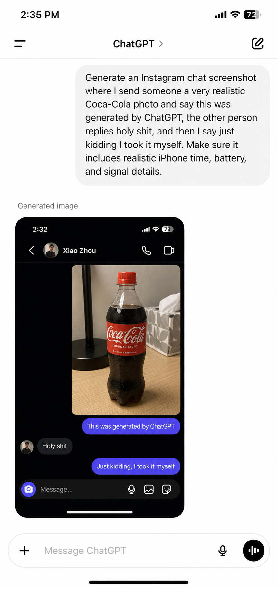

# Prompt 2: ChatGPT App Showing The Instagram DM Image

Reference image note: This image is only a visual reference. The generated result may differ slightly from the reference image; follow the written prompt as the source of truth.

Create an ultra-realistic vertical iPhone screenshot of the ChatGPT iOS app in light mode. The image must look exactly like a real ChatGPT mobile app screenshot, with authentic iPhone proportions, clean white background, natural spacing, real iOS typography, and believable UI details. Do not make it look like a mockup or poster. Everything visible must be in English.

Status bar:
- Time: 2:35 PM
- Cellular signal icon
- Wi-Fi icon
- Battery icon showing 72%

ChatGPT header:
- White header
- Menu icon on the left
- Center title: "ChatGPT >"
- Compose/edit icon on the right
- Thin divider line under the header

Main user prompt bubble:
- Large light-gray rounded user message bubble aligned to the right
- Exact text inside the bubble:
"Generate an Instagram chat screenshot where I send someone a very realistic Coca-Cola photo and say this was generated by ChatGPT, the other person replies holy shit, and then I say just kidding I took it myself. Make sure it includes realistic iPhone time, battery, and signal details."

Below the prompt bubble:
- Small gray label text: "Generated image"

Generated image preview card:
- Show a realistic embedded Instagram DM screenshot in dark mode
- The embedded image must match this scene:
  - iPhone status bar time: 2:32
  - Battery: 73%
  - Contact name: "Xiao Zhou"
  - Instagram DM header with avatar, phone icon, and video icon
  - A realistic indoor photo of a plastic Coca-Cola bottle on a light wooden desk
  - Bottle has red cap, red English Coca-Cola label, dark soda inside
  - Background includes a black desk lamp, tissue box, and indoor wall
  - Chat messages:
    - "This was generated by ChatGPT"
    - "Holy shit"
    - "Just kidding, I took it myself"
  - Bottom Instagram DM input bar with "Message..." placeholder, camera, microphone, image, and emoji/sticker icons

Bottom ChatGPT input bar:
- Rounded white input bar
- Plus icon on the left
- Placeholder: "Message ChatGPT"
- Microphone icon
- Black circular voice button on the right
- iPhone home indicator at the bottom

Quality requirements:
- All text must be sharp and readable
- White ChatGPT interface
- Real iPhone screenshot look
- No Chinese text
- No watermark
- No random extra UI
- No obvious AI artifacts
