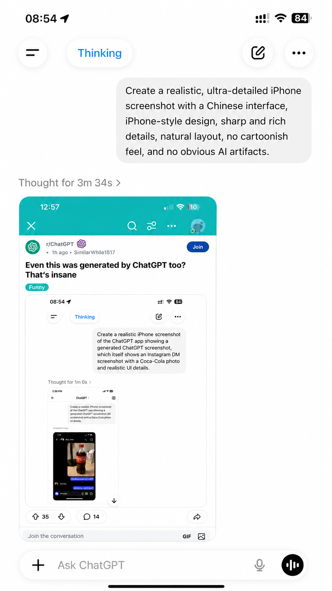

# Prompt 5: Final ChatGPT Screenshot Containing The Reddit Screenshot

Reference image note: This image is only a visual reference. The generated result may differ slightly from the reference image; follow the written prompt as the source of truth.

Create an ultra-realistic vertical iPhone screenshot of the ChatGPT iOS app in light mode, showing a generated image that is itself a Reddit post screenshot containing nested generated screenshots. The final result must look like a genuine iPhone screenshot of the ChatGPT app, with authentic iOS proportions, natural spacing, soft shadows, crisp text, and no obvious AI artifacts. Everything visible must be in English.

Outer iPhone status bar:
- Time: 08:54
- Cellular signal icon
- Wi-Fi icon
- Battery icon showing 84%

Outer ChatGPT top UI:
- White background
- Left circular hamburger menu button
- Blue pill label: "Thinking"
- Right circular compose/edit icon
- Right circular three-dot menu icon

Outer user prompt bubble:
- Large light-gray rounded bubble aligned to the upper right
- Exact text:
"Create a realistic, ultra-detailed iPhone screenshot, iPhone-style design, sharp and rich details, natural layout, no cartoonish feel, and no obvious AI artifacts."

Below the bubble:
- Gray text: "Thought for 3m 34s >"

Generated image preview:
- A rounded image card showing a Reddit mobile app screenshot
- The Reddit screenshot inside must look like a real Reddit iPhone post page
- Reddit screenshot details:
  - Teal header
  - Status time: 12:57
  - Low battery around 10%
  - r/ChatGPT post
  - Metadata: "* 1h ago * SimilarWhile1517"
  - Blue button: "Join"
  - Title:
"Even this was generated by ChatGPT too?
That's insane"
  - Flair: "Funny"
  - Embedded image showing a ChatGPT "Thinking" screenshot
  - Reaction row: upvote count "35", comments "14", share icon
  - No URL line
  - No "40" award item
  - Bottom input text: "Join the conversation"

Nested embedded ChatGPT screenshot inside the Reddit post:
- White ChatGPT interface
- Blue "Thinking" pill
- Prompt bubble:
"Create a realistic iPhone screenshot of the ChatGPT app showing a generated ChatGPT screenshot, which itself shows an Instagram DM screenshot with a Coca-Cola photo and realistic UI details."
- Gray line: "Thought for 1m 0s >"
- Smaller ChatGPT screenshot containing an Instagram DM preview

Deepest Instagram DM screenshot:
- Dark-mode Instagram DM
- Contact: "Xiao Zhou"
- Realistic photo of a plastic Coca-Cola bottle with red cap, red English label, dark soda, on a light wooden desk
- Background: black desk lamp, tissue box, indoor wall
- Messages:
  - "This was generated by ChatGPT"
  - "Holy shit"
  - "Just kidding, I took it myself"
- Instagram input bar with "Message..."

Bottom of the outer ChatGPT screen:
- Rounded input bar
- Plus icon on the left
- Placeholder: "Ask ChatGPT"
- Microphone icon
- Black circular voice button
- iPhone home indicator

Quality requirements:
- All nested text should remain as sharp and readable as possible
- Use realistic screenshot compression and scaling
- No Chinese text
- No distorted UI
- No random extra text
- No watermark
- No cartoon or poster style
