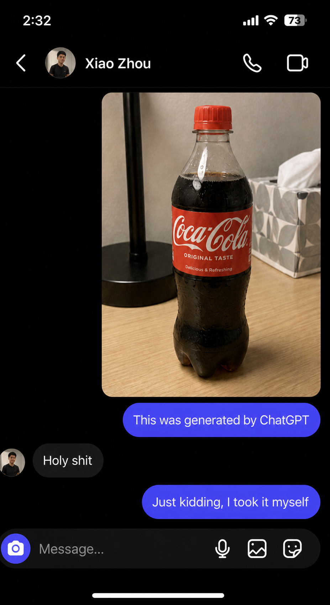
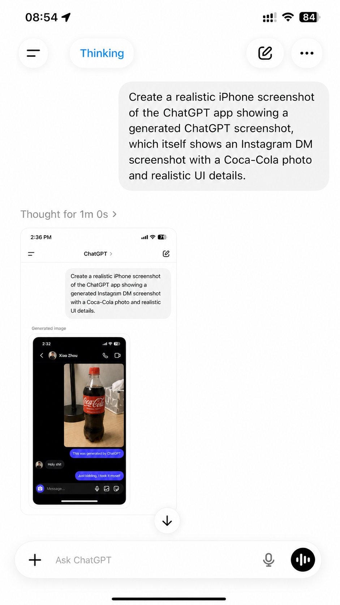
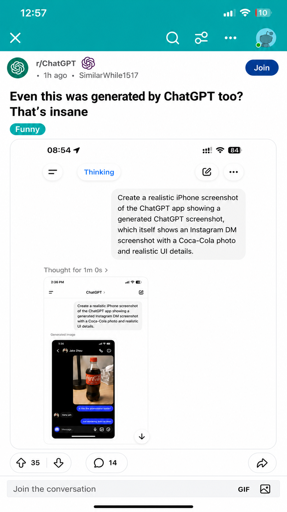

# All Prompts

## Prompt 1: Instagram DM Screenshot

Reference image note: This image is only a visual reference. The generated result may differ slightly from the reference image; follow the written prompt as the source of truth.

Create an ultra-realistic vertical iPhone screenshot of an Instagram Direct Message conversation in dark mode. It must look like a real iPhone screenshot, not a poster, mockup, concept image, or AI render. Use authentic Instagram DM spacing, proportions, icons, typography, and alignment. Everything visible must be in English.

Canvas: tall iPhone portrait screenshot, black Instagram DM background, no phone frame.

Status bar:
- Time: 2:32
- White cellular signal bars
- White Wi-Fi icon
- Battery icon showing 73%

Header:
- Back chevron on the far left
- Small circular profile avatar of a young man
- Contact name: "Xiao Zhou"
- Phone call icon on the right
- Video call icon on the far right
- Thin divider line below the header

Main chat content:
- A large rounded-corner photo message aligned to the right side
- The photo is a realistic casual indoor phone photo of a plastic Coca-Cola bottle on a light wooden desk
- Bottle details: plastic Coca-Cola bottle, red cap, red English Coca-Cola label, dark soda inside, realistic reflections and condensation, standing upright
- Background in the photo: black desk lamp on the left, gray-and-white tissue box on the right, beige indoor wall, soft indoor lighting, normal casual phone-photo look, not an advertisement
- The photo must be sharp and realistic

Messages:
- Right-side Instagram blue/purple gradient bubble under the photo: "This was generated by ChatGPT"
- Left-side dark gray bubble with the sender avatar beside it: "Holy shit"
- Right-side Instagram blue/purple gradient bubble: "Just kidding, I took it myself"

Bottom input bar:
- Rounded dark Instagram DM input bar
- Purple-blue circular camera icon on the left
- Placeholder text: "Message..."
- Microphone icon, image icon, and sticker/emoji icon on the right
- iPhone home indicator at the bottom

Quality requirements:
- All text must be sharp and readable
- No Chinese text
- No WeChat UI
- No green bubbles
- No distorted icons
- No random extra text
- No obvious AI artifacts
- No watermark

## Prompt 2: ChatGPT App Showing The Instagram DM Image

Reference image note: This image is only a visual reference. The generated result may differ slightly from the reference image; follow the written prompt as the source of truth.

Create an ultra-realistic vertical iPhone screenshot of the ChatGPT iOS app in light mode. The image must look exactly like a real ChatGPT mobile app screenshot, with authentic iPhone proportions, clean white background, natural spacing, real iOS typography, and believable UI details. Do not make it look like a mockup or poster. Everything visible must be in English.

Status bar:
- Time: 2:35 PM
- Cellular signal icon
- Wi-Fi icon
- Battery icon showing 72%

ChatGPT header:
- White header
- Menu icon on the left
- Center title: "ChatGPT >"
- Compose/edit icon on the right
- Thin divider line under the header

Main user prompt bubble:
- Large light-gray rounded user message bubble aligned to the right
- Exact text inside the bubble:
"Generate an Instagram chat screenshot where I send someone a very realistic Coca-Cola photo and say this was generated by ChatGPT, the other person replies holy shit, and then I say just kidding I took it myself. Make sure it includes realistic iPhone time, battery, and signal details."

Below the prompt bubble:
- Small gray label text: "Generated image"

Generated image preview card:
- Show a realistic embedded Instagram DM screenshot in dark mode
- The embedded image must match this scene:
  - iPhone status bar time: 2:32
  - Battery: 73%
  - Contact name: "Xiao Zhou"
  - Instagram DM header with avatar, phone icon, and video icon
  - A realistic indoor photo of a plastic Coca-Cola bottle on a light wooden desk
  - Bottle has red cap, red English Coca-Cola label, dark soda inside
  - Background includes a black desk lamp, tissue box, and indoor wall
  - Chat messages:
    - "This was generated by ChatGPT"
    - "Holy shit"
    - "Just kidding, I took it myself"
  - Bottom Instagram DM input bar with "Message..." placeholder, camera, microphone, image, and emoji/sticker icons

Bottom ChatGPT input bar:
- Rounded white input bar
- Plus icon on the left
- Placeholder: "Message ChatGPT"
- Microphone icon
- Black circular voice button on the right
- iPhone home indicator at the bottom

Quality requirements:
- All text must be sharp and readable
- White ChatGPT interface
- Real iPhone screenshot look
- No Chinese text
- No watermark
- No random extra UI
- No obvious AI artifacts

## Prompt 3: ChatGPT Thinking Screenshot With Nested ChatGPT Image

Reference image note: This image is only a visual reference. The generated result may differ slightly from the reference image; follow the written prompt as the source of truth.

Create an ultra-realistic vertical iPhone screenshot of the ChatGPT iOS app in light mode, showing a nested generated screenshot. The layout must feel like a real ChatGPT mobile screenshot, not a poster or mockup. Use authentic iOS proportions, soft shadows, realistic spacing, and sharp readable text. Everything visible must be in English.

Outer iPhone status bar:
- Time: 08:54
- Cellular signal icon
- Wi-Fi icon
- Battery icon showing 84%

Top ChatGPT UI:
- White background
- Left circular menu button with hamburger icon
- Blue pill label: "Thinking"
- Right circular compose/edit icon
- Right circular three-dot menu icon

Main user message:
- Large light-gray rounded bubble aligned toward the upper right
- Exact text:
"Create a realistic iPhone screenshot of the ChatGPT app showing a generated ChatGPT screenshot, which itself shows an Instagram DM screenshot with a Coca-Cola photo and realistic UI details."

Below it:
- Gray text line: "Thought for 1m 0s >"

Generated image area:
- Show a smaller rounded screenshot card of a ChatGPT app page
- Inside that smaller ChatGPT screenshot:
  - Status bar time: 2:36 PM
  - Battery around 71%
  - Header: "ChatGPT >"
  - A user prompt bubble saying:
"Create a realistic iPhone screenshot of the ChatGPT app showing a generated Instagram DM screenshot with a Coca-Cola photo and realistic UI details."
  - A label: "Generated image"
  - A preview image of the Instagram DM screenshot from Prompt 1
  - The Instagram DM screenshot must contain:
    - Contact name "Xiao Zhou"
    - Coca-Cola bottle photo on a light wooden desk
    - Black desk lamp, tissue box, indoor wall
    - Messages: "This was generated by ChatGPT", "Holy shit", "Just kidding, I took it myself"
    - Bottom input bar with "Message..."

Bottom of the outer ChatGPT screen:
- Large rounded input bar
- Plus icon on the left
- Placeholder text: "Ask ChatGPT"
- Microphone icon
- Black circular voice button
- iPhone home indicator

Quality requirements:
- Nested content must remain believable and readable
- No Chinese text
- No distorted UI
- No extra captions
- No watermark
- Real iPhone screenshot appearance

## Prompt 4: Reddit Post Containing The Nested Image

Reference image note: This image is only a visual reference. The generated result may differ slightly from the reference image; follow the written prompt as the source of truth.

Create an ultra-realistic vertical iPhone screenshot of the Reddit mobile app in light mode, showing a post in r/ChatGPT. The screenshot must look like a real Reddit app screenshot taken on an iPhone, with accurate mobile spacing, realistic status bar, sharp typography, and natural UI. Do not make it look like a mockup, poster, or AI-generated concept. Everything visible must be in English.

Top Reddit app bar:
- Teal gradient header
- iPhone status bar time: 12:57
- Cellular signal icon
- Wi-Fi icon
- Battery icon showing low battery around 10%
- White X close icon on the left
- Search icon
- Filter/sliders icon
- Three-dot menu icon
- Small Reddit avatar icon on the right

Post header:
- Subreddit icon similar to ChatGPT swirl, green circle
- Text: "r/ChatGPT"
- Purple ChatGPT-like icon beside it
- Metadata line: "* 1h ago * SimilarWhile1517"
- Blue rounded button on the right: "Join"
- No Discord logo

Post title:
"Even this was generated by ChatGPT too?
That's insane"

Flair:
- Small teal rounded flair: "Funny"

Embedded image:
- A large rounded image preview occupying most of the post width
- The embedded image is a ChatGPT "Thinking" screenshot
- Inside the embedded image:
  - ChatGPT iOS light-mode interface
  - Top status bar: 08:54, battery 84%
  - Blue "Thinking" pill
  - User message bubble:
"Create a realistic iPhone screenshot of the ChatGPT app showing a generated ChatGPT screenshot, which itself shows an Instagram DM screenshot with a Coca-Cola photo and realistic UI details."
  - Gray line: "Thought for 1m 0s >"
  - Nested ChatGPT screenshot showing an Instagram DM screenshot with a Coca-Cola bottle photo
  - Instagram DM contains "Xiao Zhou", Coca-Cola bottle on desk, and messages:
    - "This was generated by ChatGPT"
    - "Holy shit"
    - "Just kidding, I took it myself"

Below the embedded image:
- Do not show any URL or link
- Reaction row:
  - Upvote/downvote pill with number "35"
  - Comment pill with number "14"
  - Share icon on the far right
- Do not show the "40" award/reaction item

Bottom comment bar:
- Light gray input field text: "Join the conversation"
- "GIF" text button
- Image icon
- iPhone home indicator at the bottom

Quality requirements:
- All text must be sharp and readable
- Keep Reddit mobile UI proportions realistic
- No Chinese text
- No random extra text
- No watermark
- No obvious AI artifacts

## Prompt 5: Final ChatGPT Screenshot Containing The Reddit Screenshot

Reference image note: This image is only a visual reference. The generated result may differ slightly from the reference image; follow the written prompt as the source of truth.

Create an ultra-realistic vertical iPhone screenshot of the ChatGPT iOS app in light mode, showing a generated image that is itself a Reddit post screenshot containing nested generated screenshots. The final result must look like a genuine iPhone screenshot of the ChatGPT app, with authentic iOS proportions, natural spacing, soft shadows, crisp text, and no obvious AI artifacts. Everything visible must be in English.

Outer iPhone status bar:
- Time: 08:54
- Cellular signal icon
- Wi-Fi icon
- Battery icon showing 84%

Outer ChatGPT top UI:
- White background
- Left circular hamburger menu button
- Blue pill label: "Thinking"
- Right circular compose/edit icon
- Right circular three-dot menu icon

Outer user prompt bubble:
- Large light-gray rounded bubble aligned to the upper right
- Exact text:
"Create a realistic, ultra-detailed iPhone screenshot, iPhone-style design, sharp and rich details, natural layout, no cartoonish feel, and no obvious AI artifacts."

Below the bubble:
- Gray text: "Thought for 3m 34s >"

Generated image preview:
- A rounded image card showing a Reddit mobile app screenshot
- The Reddit screenshot inside must look like a real Reddit iPhone post page
- Reddit screenshot details:
  - Teal header
  - Status time: 12:57
  - Low battery around 10%
  - r/ChatGPT post
  - Metadata: "* 1h ago * SimilarWhile1517"
  - Blue button: "Join"
  - Title:
"Even this was generated by ChatGPT too?
That's insane"
  - Flair: "Funny"
  - Embedded image showing a ChatGPT "Thinking" screenshot
  - Reaction row: upvote count "35", comments "14", share icon
  - No URL line
  - No "40" award item
  - Bottom input text: "Join the conversation"

Nested embedded ChatGPT screenshot inside the Reddit post:
- White ChatGPT interface
- Blue "Thinking" pill
- Prompt bubble:
"Create a realistic iPhone screenshot of the ChatGPT app showing a generated ChatGPT screenshot, which itself shows an Instagram DM screenshot with a Coca-Cola photo and realistic UI details."
- Gray line: "Thought for 1m 0s >"
- Smaller ChatGPT screenshot containing an Instagram DM preview

Deepest Instagram DM screenshot:
- Dark-mode Instagram DM
- Contact: "Xiao Zhou"
- Realistic photo of a plastic Coca-Cola bottle with red cap, red English label, dark soda, on a light wooden desk
- Background: black desk lamp, tissue box, indoor wall
- Messages:
  - "This was generated by ChatGPT"
  - "Holy shit"
  - "Just kidding, I took it myself"
- Instagram input bar with "Message..."

Bottom of the outer ChatGPT screen:
- Rounded input bar
- Plus icon on the left
- Placeholder: "Ask ChatGPT"
- Microphone icon
- Black circular voice button
- iPhone home indicator

Quality requirements:
- All nested text should remain as sharp and readable as possible
- Use realistic screenshot compression and scaling
- No Chinese text
- No distorted UI
- No random extra text
- No watermark
- No cartoon or poster style
